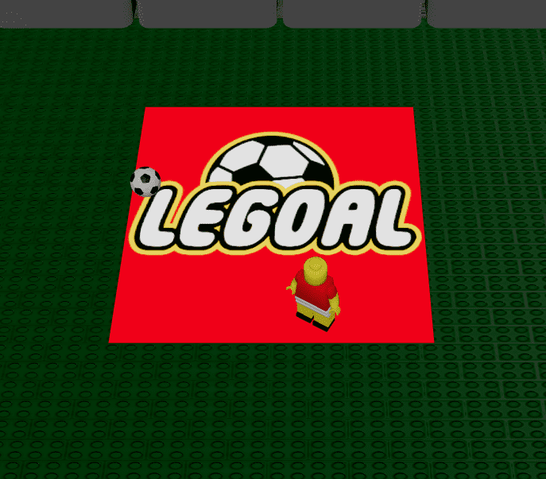

# LEGOAL

## Description

A simple multiplayer soccer game

## Technology

Library: [React](https://react.dev/)
3d renderer: [React-Three-Fiber (R3F)](https://github.com/pmndrs/react-three-fiber)
R3F helpers: [Drei](https://github.com/pmndrs/drei)
Physics: [Rapier](https://github.com/pmndrs/react-three-rapier)
Stand-alone library of threejs examples: [three-stdlib](https://github.com/pmndrs/three-stdlib)
Game state: [Zustand](https://github.com/pmndrs/zustand)
Multiplayer Socket: [Playroomkit](https://docs.joinplayroom.com/)

## Assets

Walls and flag retrieved from Mecabricks.com

## How to play

The first to connect is the game host and has to share the link on the first screen to other players to join

## Controls

Keyboard arrow to move and X to shoot
